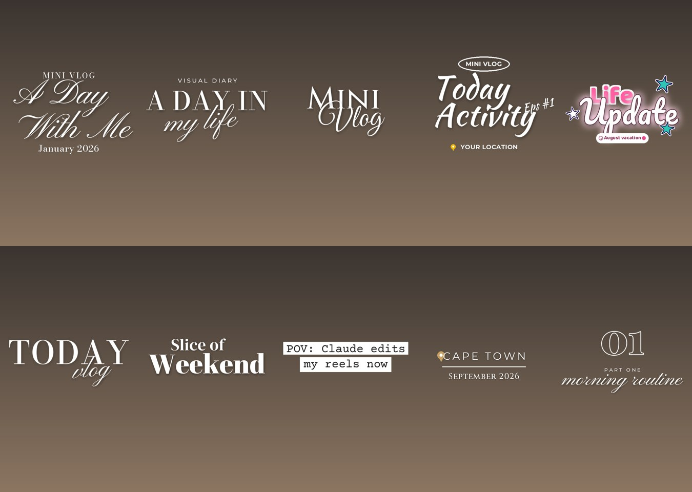
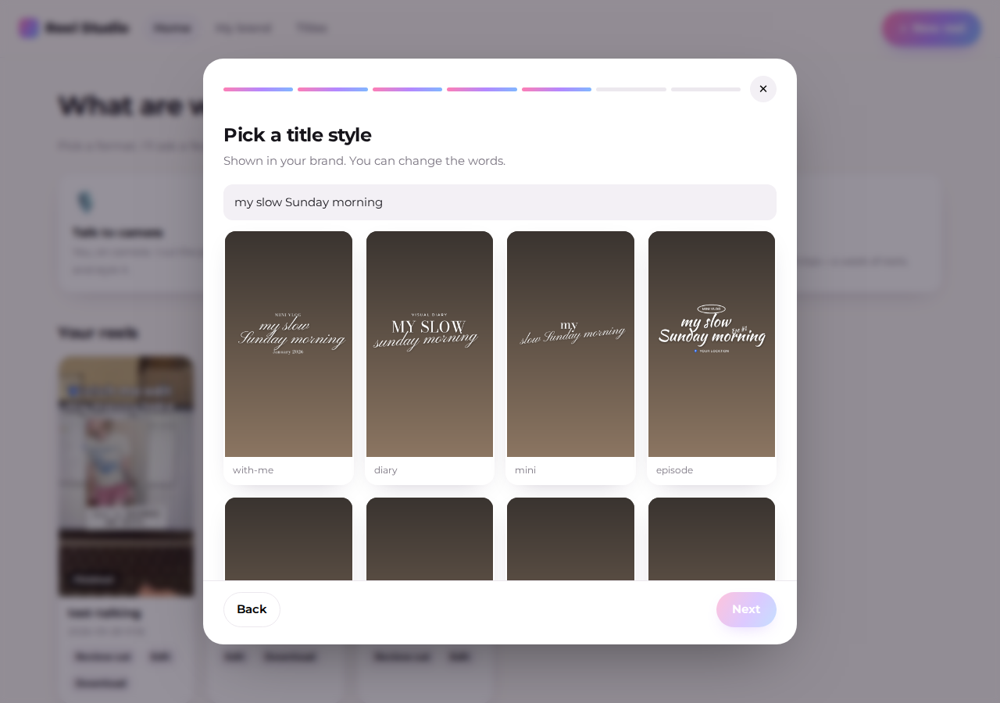
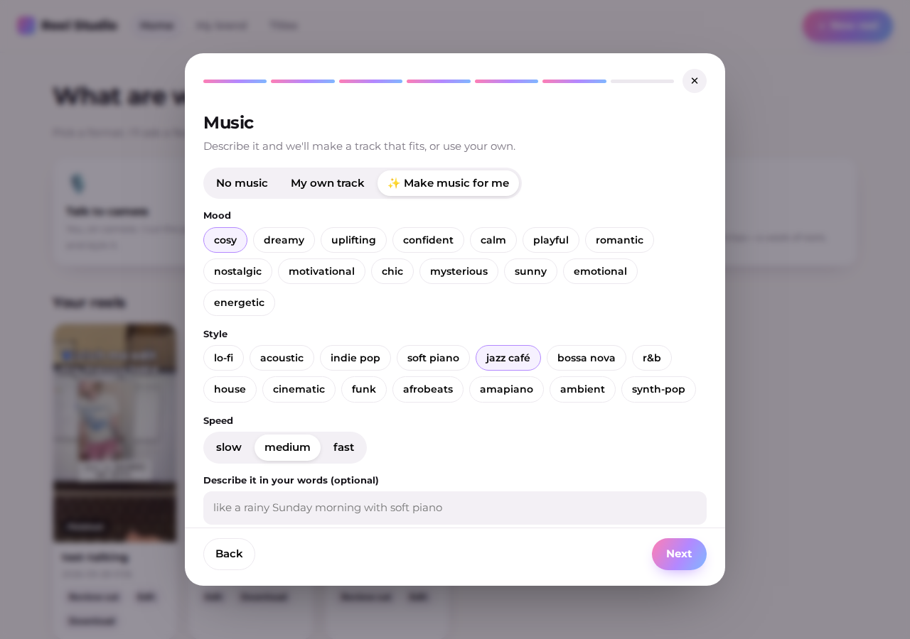
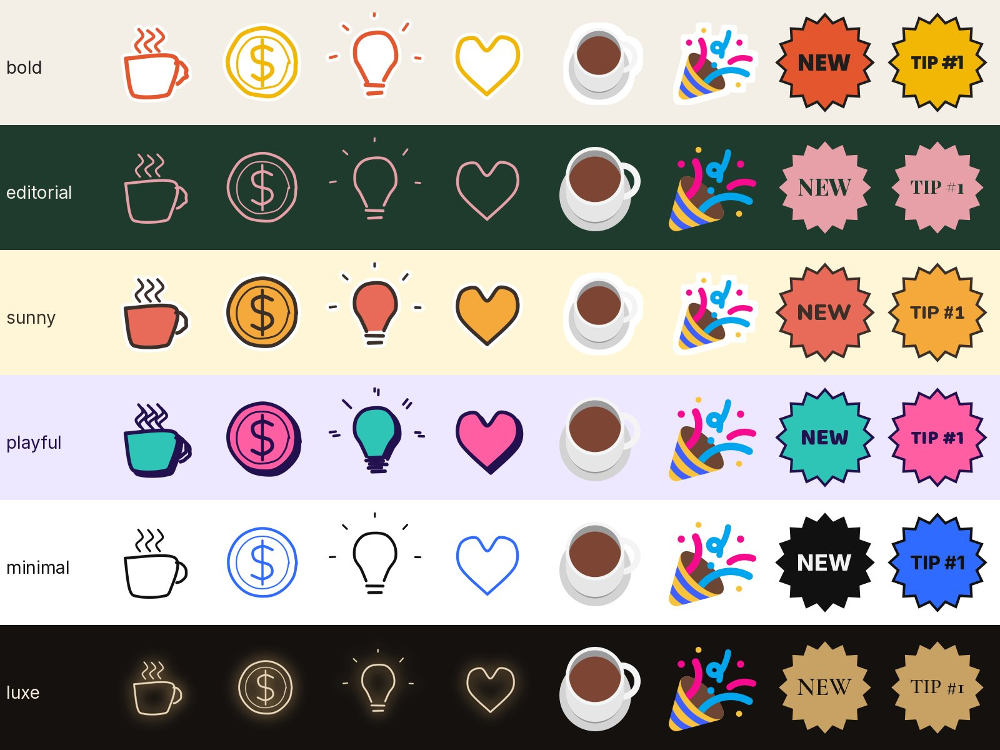
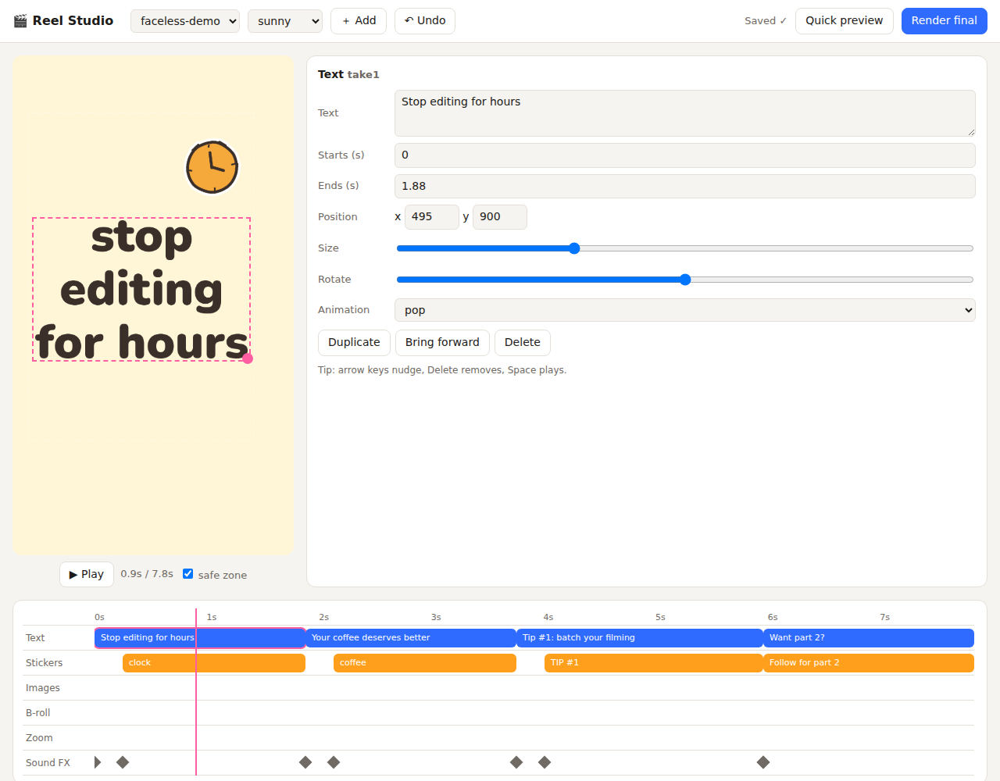
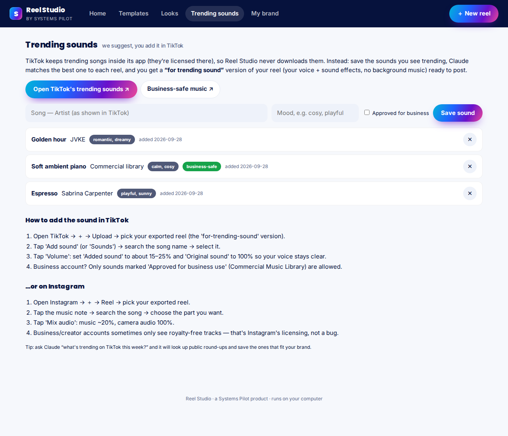
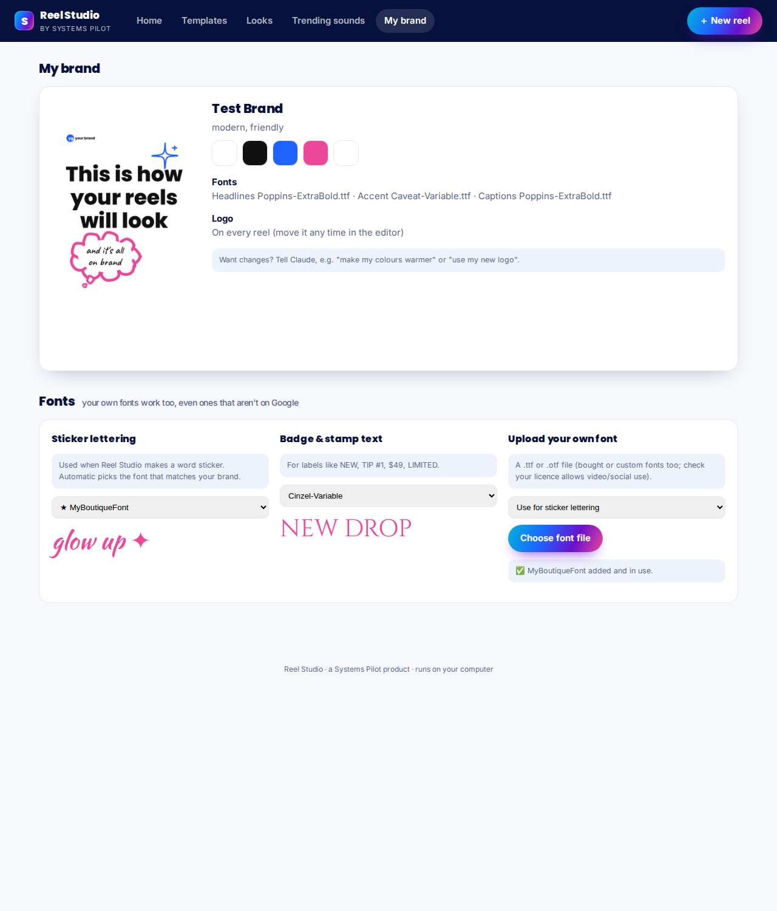
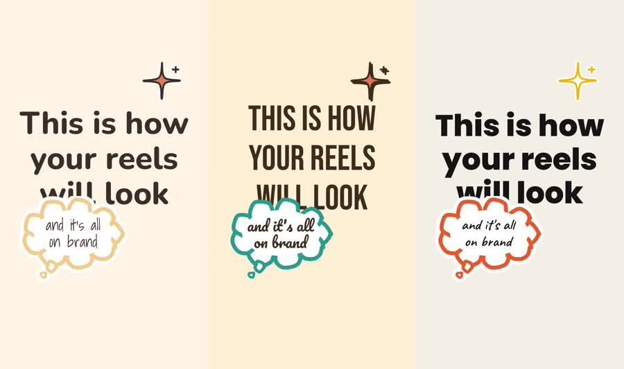

# Reel Studio · by Systems Pilot

**Claude becomes your reel editor, in your brand.** Film on your phone, drop the clip in,
and Claude cuts the pauses and retakes, adds captions, big text moments, stickers, sound
effects, your logo and a colour grade, then hands you a ready-to-post reel and cover.
Want to adjust something? Drag it in the built-in editor.

Built for creators and small businesses who are *not* editors. No jargon, no templates that
look like templates: every look comes from the user's own brand.

➡️ **New user? Read [START-HERE.md](START-HERE.md)**: what to have ready for setup.
➡️ **Selling it / installing it for buyers:** [docs/selling-and-installing.md](docs/selling-and-installing.md).

## What it does
| | |
|---|---|
| **Studio app** | A beautiful home screen with a step-by-step questionnaire for every reel: format, video, idea, vibe, title style, music, captions. |
| **Designer titles** | Ten layered title styles (script over serif, tracked caps, dates, pills, sparkles, typewriter), in *your* brand fonts. |
| **Text behind you** | A big word placed behind your head automatically (on-device person cut-out). |
| **Music, included** | Describe it (mood, style, speed, energy) and a track is composed on your computer: free, royalty-free, instant. Optional ElevenLabs for studio-grade AI music (paid, your key). |
| **Templates** | 22 proven reel ideas (day in my life, photo dump, recaps, GRWM, POV, tips, product drop…) with shot lists, done in your brand. |
| **1,500+ stickers** | Every concept in 12 styles (die-cut, app-icon chip, puffy 3D, holographic, retro, neon…) plus glossy 3D emoji, animated emoji and stamps. |
| **Motion** | 13 transitions (whip, flash, zoom blur, glitch, light leak, brand-colour wipe…) and 8 camera moves (punch, push, whip, shake, focus…). |
| **Brand interview** | Claude sets up your look from your website, your logo/mood board, or suggests 3 starter looks if you don't have a brand yet. |
| **Rough cut** | Local transcription; removes pauses, "um"s, stutters, repeated takes (keeps your last, best take), stray "so… okay… yeah" and drawn-out hesitations. |
| **Auto director** | Watches your footage: steadies shaky phone video, punches in on your face at every cut (finds where your face really is), slow push-ins on product shots, emphasis bumps on key words, transitions only where the angle changes. |
| **Premium look by default** | Frosted-glass labels that blur the live video behind them, product callouts (dot · line · label), elegant serif words. No cheap die-cut clip-art. Playful brands can switch to fun sticker styles. |
| **Premium picture** | Every video is measured and corrected (colour cast, exposure, flat contrast), then finished like a pro edit: fine sharpening, film grain, soft vignette. |
| **Quality check on every reel** | Before you see it: no 5-second stretch without movement, a hook in the first second, nothing covering a face, max 2 graphics at once, loudness checked. A plain-words "what I did" list comes with every reel. |
| **Keep editing anywhere** | Export as layers (clean video · transparent graphics · transparent captions · audio) for CapCut, Premiere, DaVinci Resolve or Final Cut. |
| **Batch + trial reels** | Chop long clips into the best 6-second b-roll (sharp, steady, well lit), put a hook on each, and get a captions map ready to post. |
| **Sounds like you** | Learns your voice from your last 15 reels (hooks, phrases, captions) so scripts never sound like AI. Tutor-me breaks down why a viral reel worked so you can make your own. |
| **Studio sound** | Background noise measured on every video (room noise, hum, distortion) and cleaned to match: hiss removed, speech denoiser for noisy rooms, clearer and more even, loudness set for TikTok/Instagram, music audible under your voice, stereo. |
| **Review page** | Every line with its length: keep/remove, notes (💬), attachments (📎), goal length. |
| **Style plan** | Claude picks the edit from your idea (tips, story, before/after…) and explains it in plain words. |
| **Automatic stickers** | On-topic stickers timed to your words, in your brand colours: doodle, flat, retro, neon, emoji or badges. |
| **Stickers that don't exist yet? It makes them.** | If a sticker isn't in the library and isn't auto-detected, Reel Studio **creates your own**: instantly as a custom lettered sticker in your brand font and colours, then Claude draws a proper illustrated version that's added to the library for every future reel. You never hear "we don't have that one." |
| **Your fonts, everywhere** | Google Fonts are fetched automatically, and you can **upload your own font** (.ttf/.otf, e.g. a bought or custom font). Stickers use fonts that match your brand automatically, or pick a font for sticker lettering and for badges/stamps (even per sticker). |
| **Trending sounds** | Save what's trending on TikTok (one click to TikTok's own list), Claude suggests the best match per reel, and every render includes a *for-trending-sound* version (voice + effects, no music) so you add the sound in TikTok. Business-safe filter included. |
| **Text that always fits** | Hooks, takeovers, bubbles and captions auto-size; nothing overflows or hides under app buttons. |
| **Captions** | 15 styles, including **pop** (big bold caps; the important words bigger in your colour, the spoken word pops), karaoke, highlight pill, bounce, box, outline, neon, typewriter, elegant… |
| **Sound** | Pops, whooshes, hits, risers, dings placed on the action; your music ducked under your voice. |
| **Filters** | 29 looks (latte, clean girl, portrait film, disposable, dreamy haze, VHS…) previewed on your own video, or your own LUT. |
| **Inspiration reels** | Paste reels you love; it learns pacing, colour and text style and applies it to yours. |
| **Manual editor** | Drag logo/text/stickers anywhere, trim timing on a timeline, change styles, render. |
| **Lean on credits** | Heavy work runs on your computer. See [docs/usage-and-credits.md](docs/usage-and-credits.md). |










## Install
**Mac:** double-click `install/install-mac.command`, then `install/Reel Studio.command` to open.
**Windows:** right-click `install/install-windows.ps1` → Run with PowerShell, then double-click `install/Reel Studio.bat`.

Manual install:
```bash
# 1. system tools: ffmpeg (brew install ffmpeg / winget install ffmpeg) and Python 3.10+
# 2. python libraries
pip install -r requirements.txt
# 3. check
python -m engine setup-check
```
Then open this folder in **Claude Code** and say hi. Claude runs the brand interview first.
Start the Studio app any time with `python -m engine studio` (opens in your browser).

Optional AI music: add `ELEVENLABS_API_KEY=...` to `brand/.env` (Eleven Music is a paid
service, charged per generated track by ElevenLabs).

## For developers
- `CLAUDE.md`: how Claude should behave here; `.claude/skills/`: the skills.
- `engine/`: Python engine (`python -m engine --help`). Pipeline:
  `new → roughcut → review → plan.json → timeline → render` (+ `editor`, `inspire`, `brand-*`).
- `library/`: style packs, OFL fonts, sticker SVGs. `docs/knowledge/`: design training material.
- Tests: `python -m pytest tests -q`.
- Credits and licences: [docs/CREDITS.md](docs/CREDITS.md).

## Roadmap
Beat-synced cuts to music · face-tracked reframing · photo cut-out stickers · more title
styles and animated sticker packs · HyperFrames renderer for richer motion graphics ·
local (free) music generation option · Spanish UI · packaged desktop installer.
